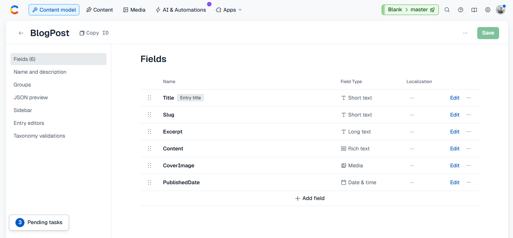

# The Blog

A modern blog platform built with Next.js App Router, TypeScript, Tailwind CSS, shadcn/ui, and Contentful CMS.

## Live Demo

Deployed URL:
https://eshkon-assignment-kappa.vercel.app/

---

## GitHub Repository

Repository URL:
https://github.com/sahilnikalje/eshkon-assignment

---

## Tech Stack

- Next.js 16
- TypeScript
- Tailwind CSS
- shadcn/ui
- Contentful CMS
- Vercel

---

## Features

- Modern responsive UI
- Home page with hero section
- Blog listing page
- Dynamic blog detail pages
- Rich text rendering
- SEO metadata generation
- ISR / revalidation
- Optimized images using next/image
- Loading states
- 404 handling

---

## Project Structure

```txt
src/
├── app/
│   ├── layout.tsx
│   ├── page.tsx
│   ├── not-found.tsx
│   ├── blog/
│   │   ├── page.tsx
│   │   └── [slug]/
│   │       ├── page.tsx
│   │       └── loading.tsx
├── components/
│   ├── layout/
│   │   ├── Navbar.tsx
│   │   └── Footer.tsx
│   ├── blog/
│   │   ├── BlogCard.tsx
│   │   ├── BlogGrid.tsx
│   │   └── RichTextRender.tsx
│   └── home/
│       ├── Hero.tsx
│       └── LatestPosts.tsx
├── lib/
│   └── contentful.ts
├── types/
│   └── blog.ts
```

---

## Setup Instructions

Clone the repository:

```bash
git clone https://github.com/sahilnikalje/eshkon-assignment.git
```

Install dependencies:

```bash
npm install
```

Create `.env.local`:

```env
CONTENTFUL_SPACE_ID=your_space_id
CONTENTFUL_ACCESS_TOKEN=your_access_token
```

Run development server:

```bash
npm run dev
```

Build project:

```bash
npm run build
```

---

## Contentful Content Model

Content Type:
```txt
BlogPost
```

Fields:
- title
- slug
- excerpt
- content
- coverImage
- publishedDate

---

## Contentful Model Screenshot



---

## Deployment

The project is deployed using Vercel.

Production URL:
https://eshkon-assignment-kappa.vercel.app/

---
